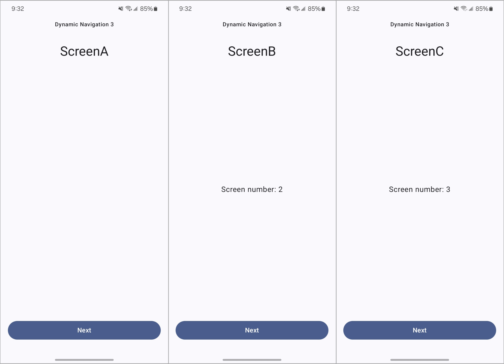

# Compose Navigation 3 - Dynamic Destinations Sample

<p align="center">
  
</p>

This repository contains a sample app that demonstrates how to implement dynamic destinations with [Jetpack Navigation 3](https://developer.android.com/guide/navigation/navigation-3) library.

Typically, in Navigation 3 and its older version (sometimes referred to as Navigation 2), destinations are declared statically. This means all possible destinations must be specified upfront, at the moment their respective navigation container (`NavDisplay` or `NavHost`) is used in code.

But what if you don't know in advance what navigation destinations your app will have? While this is a less common use case, sometimes destinations will be known only at the moment the actual navigation happens. In this case, they must be registered dynamically, outside of the navigation graph declaration.

Learn more about it in the [Dynamic destinations with Jetpack Navigation 3](https://morfly.medium.com/dynamic-destinations-with-jetpack-navigation-3-41b851eef933) blog post.

## Project structure
This repository explores dynamic destinations in Navigation 3 and how they are compared with the more conventinal usages of the Compose Navigation library. The project includes **3** different implementations of the same navigation flow:

- [**nav2/static**](app/src/main/java/io/morfly/navsample/nav2/static/NavigationV2Static.kt) — example of using the old version of Compose Navigation library with statically declared destinations.
- [**nav3/static**](app/src/main/java/io/morfly/navsample/nav3/static/NavigationV3Static.kt) — example of using Navigation 3 with statically declared destinations.
- [**nav3/dynamic**](app/src/main/java/io/morfly/navsample/nav3/dynamic/NavigationV3Dynamic.kt) — example of using Navigation 3 with dynamic destinations.

## How to configure sample app
You can configure which implementation of the navigation flow to use by changing the value of the `navImplementation` variable in the [`NavigationContailer.kt`](app/src/main/java/io/morfly/navsample/NavigationContainer.kt).

Just uncomment the line that points to the desired implementation and build/install the app.

```kotlin
@Composable
fun NavigationContainer(modifier: Modifier = Modifier) {
    // ===== Old Compose Navigation =====
    // val navImplementation = NavImplementation.Nav2Static

    // ===== Navigation 3 Static =====
    // val navImplementation = NavImplementation.Nav3Static

    // ===== Navigation 3 Dynamic =====
    // val navImplementation = NavImplementation.Nav3Dynamic

    NavigationContainer(modifier, navImplementation)
}
```

## Demo
This is a simplistic Android demo app that has 3 screens and allows navigation between them including arguments.



## License

```
Copyright 2025 Pavlo Stavytskyi.

Licensed under the Apache License, Version 2.0 (the "License");
you may not use this file except in compliance with the License.
You may obtain a copy of the License at

   https://www.apache.org/licenses/LICENSE-2.0

Unless required by applicable law or agreed to in writing, software
distributed under the License is distributed on an "AS IS" BASIS,
WITHOUT WARRANTIES OR CONDITIONS OF ANY KIND, either express or implied.
See the License for the specific language governing permissions and
limitations under the License.
```
